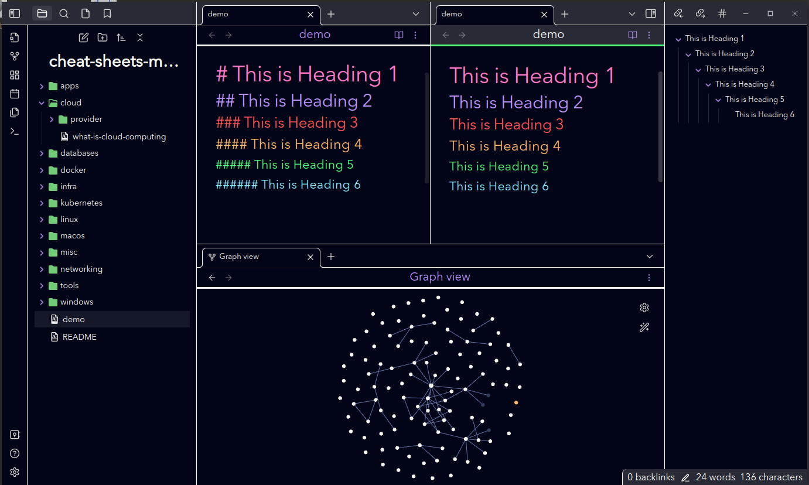

# Dracula Theme for [Obsidian.md](https://obsidian.md)

> A dark theme for [Obsidian](https://obisidian.md), compatible to Obsidian V 1.3.4

## Install

1. Download the obsidian.css file.

2. In Obsidian click Settings->Plugins and turn on "Custom CSS".

3. Put the "obsidian.css" in your vault root folder.

4. Restart Obsidian.

## License

[MIT License](./LICENSE)

## Disclaimer

This theme is provided as-is and is designed for personal use. It has not
been tested on all platforms or with all features and may not work as expected
with all future updates. If you notice something looks wrong, please open a bug
report or pull request so it can be fixed.

I did not create the original Dracula Plus colour palette. Full credit for that
goes to the original [Dracula for Obsidian](https://github.com/jarodise/Dracula-for-Obsidian.md). I have selected
colours from the original theme, adjusted them, and added additional colours for
the purposes of adapting the theme to work with other apps e.g. Obsidian and Notion.