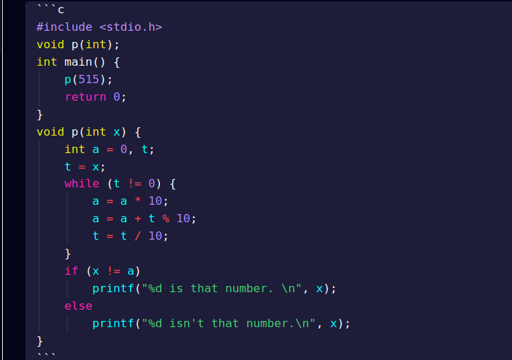

# Dracula Plus Theme for [Obsidian.md](https://obsidian.md)

> A dark theme for [Obsidian](https://obisidian.md), compatible to Pc,Tablet,Mobile.

## Dracula Plus with RGB colors


## How to set colors

1. Go to settings
2. Click on Appearence
3. Click on Accent color
4. Choose your favoruite color
5. Restart Obsidian


## Code Block

Beautiful color combination used in code block



## Checkbox Styling

Dracula Plus supports a wide number of alternate checkbox types. These allow you to call out tasks that are incomplete, cancelled, rescheduled, etc. See below for availale checkbox types.


```markdown
## Basic

- [ ] to-do
- [/] incomplete
- [x] done
- [-] cancelled
- [>] forwarded
- [<] scheduling
- [t] time

## Extras

- [?] question
- [!] important
- [*] star
- ["] quote
- [l] location
- [b] bookmark
- [i] information
- [S] savings
- [I] idea
- [p] pros
- [c] cons
- [f] fire
- [k] key
- [w] win
- [u] up
- [d] down
- [D] draft pull request
- [P] open pull request
- [M] merged pull request
```

## Install

1. Download the obsidian.css file.

2. In Obsidian click Settings->Plugins and turn on "Custom CSS".

3. Put the "obsidian.css" in your vault root folder.

4. Restart Obsidian.

## License

[MIT License](./LICENSE)

## Disclaimer

This theme is provided as is and is designed for personal use. It has not
been tested on all platforms or with all features and may not work as expected
with all future updates. If you notice something looks wrong, please open a bug
report or pull request so it can be fixed.

## Credits

I would like to thank jarodise and his theme [Dracula for Obsidian](https://github.com/jarodise/Dracula-for-Obsidian.md) and [obsidian-things](https://github.com/colineckert/obsidian-things) for his checkboxes.Also thanks to obsidian community.

Note: white theme settings will not work, there is no plan now but in future it might be possible to add white theme as well.
